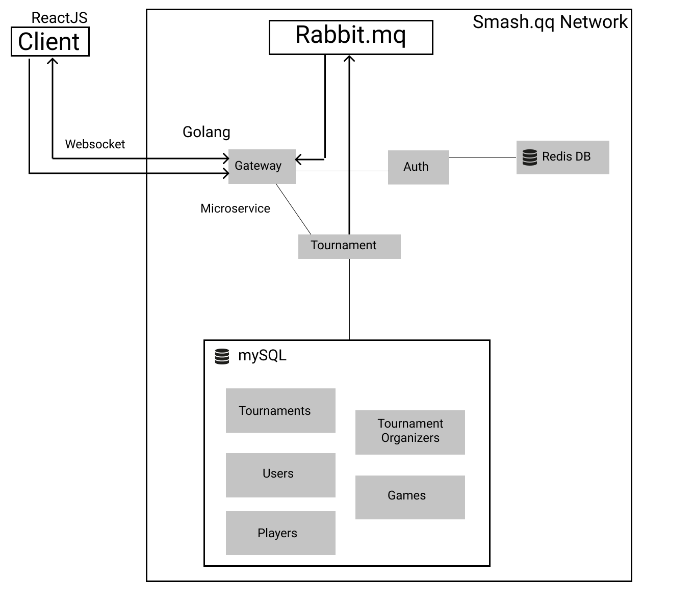

# info441finalproject
Joseph Zhang, Kevin Xu, Sunwoo Kang
Info 441 Final Project Proposal
3/1/19
 
# Super Smash Bros Tournament Organization Tool
With the recent introduction of Super Smash Bros Ultimate, the competitive scene for the renowned franchise has never been more active. From local to global events, these Smash Bros tournaments are being run daily across the world and they are only gaining more popularity over time. Although these tournaments are being run constantly, it is becoming painstakingly clear that there needs to be more regulation in the organization of these events.
Currently, tournaments use web services like Smash.gg and Challonge to create brackets, which are then overseen and regulated by tournament organizers. Everything is done manually, from the planning to the end of the tournament. This means that tournament organizers have to look through every player’s credentials and place them into a bracket. And then when it comes to the actual tournament, the organizers are running around yelling for people to come play for their turn. Amidst all of this, you factor in human error and inconsistencies, and you get a huge chaotic mess. 
We want to provide a new platform for Super Smash Bros tournaments to smooth out the process for both tournament organizers and players. It will help tournament organizers plan for their events and to help regulate everything on the day of. Players will be able to easily sign up and be alerted of when a game is ready, while also making the process of verifying information a lot easier. At the end of the day, everyone involved in the tournament process just want to enjoy playing and watching Super Smash Bros. We want to offer this service to try to minimize the possibility of error and to maximize the amount of time that people get to enjoy the tournament.
Our group honestly just loves the Super Smash Bros series. From the early competitive scene in Super Smash Bros Melee to the recent spike in Super Smash Bros Ultimate, we have been through all of the renditions and have loved this series for a long time. We have all been a part of tournaments both locally and nationally, so we've felt the frustration of having poorly run tournaments firsthand. We believe that this is an area where we can intersect our love of gaming with our abilities as software developers to provide a service that can help optimize something that we, along with many other people, love.
 
 
##  Technical Description
### Architectural Diagram

## Database Schemas
### Overall Tournaments Database

### Singular Tournament Database

## USER CASES TABLE
 
|  Priority | User  | Description  | 
|-----------|-------|--------------|
| P0  |  As a Player | I want to create an account that can save my player information.  |   
| P1 | As a tournament organizer  |  I want to be able to create a bracket while easily looking at the entrants’ information to take into consideration  |
| P2 |  As a tournament organizer | I want to start a new tournament  |
| P3 |  As a player |  I want to be able to sign up for a tournament/look for tournaments to sign up for |
| P4 |  As a player |  I want to be able to see where I play next |
| P5 | As a player  |  I want to get a notification when my game is ready |
| P6 |  As a tournament organizer | I want to enter in and confirm the match score after it is done |

 
For each of your user story, describe in 2-3 sentences what your technical implementation strategy is. Explicitly note in bold which technology you are using (if applicable):
Include a list available endpoints your application will provide and what is the purpose it serves. Ex. GET /driver/{id}
Include any database schemas as appendix
User Cases Implementation
* P0: Submit post request to /v1/users. This adds a record to the users table in the database that contains information about the player. The information can be retrieved with a get request to the same url.
* P1: Gather all registered players and create bracket by inserting games into the database with a post request to /v1/tournaments/games
* P2: Submit a post request to /v1/tournaments to create a new tournament
* P3: Submit a get request to /v1/tournaments to see all available tournaments. Once player is registered, a post request is submitted with user id as a query param to tournaments/players.
* P4: Submit a get request to /v1/tournaments/games with userid as a query param.
* P5: 
* P6: Submit a post request to /v1/tournaments/games with a query param with gameid to update score. 